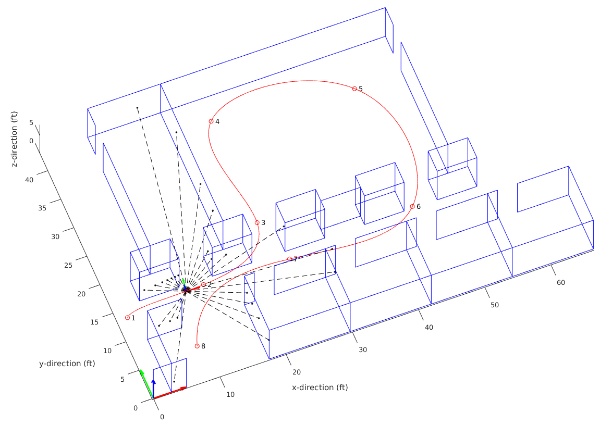

# LiDAR-Inertial Simulator

This repository has a LIDAR-inertial simulator in it that allows for custom trajectory through 3D enviroments to be created, and a sensor suite to be sent through it at a given rate.
The simplest way to get started is to clone this repository into your ROS workspace, and play around with the example datasets.

## Package Descriptions

* **lips_comm**: This package has the custom message files that the simulator should publish.
* **lips_matlab**: Contains matlab scripts to generate simulated lidar point clouds moving through a 3D environment.
* **lips_simulator**: This package also has a ros publisher node that will take the matlab exported files and publish them onto ros.

## Measurement Noise Models

#### IMU Noise Model

Based on [kalibr's](https://github.com/ethz-asl/kalibr/wiki/IMU-Noise-Model#the-imu-noise-model) IMU noise model, we say that both the acceleration and gyroscope measurements are affected by a bias random walk and noise.
Assuming that the user has specified the *continuous time* sigma parameters, we need to also ensure that we convert these into the discrete bias and white noise terms.
We keep track of the bias from measurement to measurement, which can be initialized to some initial bias value.
Formally, we define the following equations:

where

Note that the above equations are for a **single** angular acceleration, this needs to be repeated for each direction (x,y,z) which should each have their own biases.
This can then can also be repeated for the acceleration measurements.

#### LIDAR Noise Model

We can apply noise to our LIDAR point cloud using the following equations:

where 

Note that the above equations are for a **single** point coordinate, and thus needs to be repeated for x,y and z directions.
The noise sigma is not continuous so we do not need to take into account the sensor rate when adding the noise value.

## Screenshots / Pictures

 
